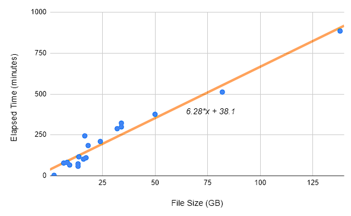

# monkeypox-nf

A monkeypox virus (MPXV) assembly pipeline using Nextflow for host-removal, reference-based assembly, and generation of sequence quality metrics for Illumina paired-end data using a shotgun metagenomic sequencing approach.

Briefly, paired-end reads are mapped to a composite reference sequence composed of the Human hg38 and MPXV reference genome with BWA-MEM and assembled with the iVar consensus tool. The sequence quality metrics are generated with samtools and Nextclade v2.

A composite reference mapping approach was chosen as we aim to capture as many MPXV reads as possible to generate a consensus sequence while excluding ALL true human reads from the final de-hosted read dataset and consensus sequence. In this approach, human reads that weakly map to the MPXV reference or to the human reference genome are removed from the read dataset. This pipeline ensures that data can be shared and published with no risk to individual privacy. More information on how the dehosting approach was tested and the metrics found can be read in the [Host Removal Report](./testing_reports/Host_Removal_Report_June_2022.md).

**Note:** Resource allocation is currently not optimized. We will be working to address that as soon as possible.

----------

## Index
- [Installation and Required Data](#installation-and-required-data)
- [Usage](#usage)
    - [Quick Start](#quick-start)
    - [Inputs](#inputs)
    - [Outputs](#outputs)
    - [Resources Needed](#resources-needed)
- [Full Pipeline Process Details](#full-pipeline-process-details)
    1. [Generate and Index Composite Reference](#1-generate-and-index-composite-reference)
    2. [Initial Fastq Quality Metrics](#2-initial-fastq-quality-metrics)
    3. [Map to Composite Reference](#3-map-to-composite-reference)
    4. [Filter BAM](#4-filter-bam)
    5. [Generate Dehosted Fastq Files](#5-generate-dehosted-fastq-files)
    6. [Assemble Consensus](#6-assemble-consensus)
    7. [Generate Sequence Metrics](#7-generate-sequence-metrics)
- [Profiles Available](#profiles-available)
- [Authors and Acknowledgment](#authors-and-acknowledgment)
    - [Citations](#citations)
- [Support](#support)
- [License](#license)

----------

## Installation and Required Data
This pipeline is run using [nextflow](https://www.nextflow.io/docs/latest/getstarted.html#requirements) and has a variety of other dependencies to run the pipeline. Installation using conda is recommended.

All instructions are for a POSIX compatible system and has only been tested on Ubuntu 20.0.4+.

### Installation Options:

#### Installation through Conda:
1. Install Conda
    - [Conda](https://docs.conda.io/en/latest/) is an open source package management system and environment management system.
    ```bash
    # Get conda
    wget https://repo.anaconda.com/miniconda/Miniconda3-latest-Linux-x86_64.sh

    # Install - follow instructions given
    bash Miniconda3-latest-Linux-x86_64.sh
    ```

2. Create a nextflow conda environment with nextflow and mamba
    - [Mamba](https://github.com/mamba-org/mamba) is an open source reimplementation of the conda package manager in C++ with some improvements that should make environment creation quicker when creating the nextflow conda environment
    ```bash
    conda create -n nextflow -c conda-forge -c bioconda -c defaults nextflow mamba
    ```

3. Optional - Setup a directory cache for conda environments
    - To avoid needing to make a new environment each time the pipeline is called, a directory can be set as a cache where `nextflow` will look for the environment before creating a new one

4. Run the pipeline using the conda profile which will install the other pipeline dependencies
    ```bash
    conda activate nextflow
    nextflow run phac-nml/monkeypox-nf -profile conda --cache [Path/to/EnvironmentCacheDir]
    ```

#### Manual Installation if not using conda:
1. Manually install nextflow
    - https://www.nextflow.io/docs/latest/getstarted.html#installation

2. Install ALL of the following dependencies:
    - [bwa](http://bio-bwa.sourceforge.net/)
    - [csvtk](https://bioinf.shenwei.me/csvtk/download/)
    - [fastqc](https://www.bioinformatics.babraham.ac.uk/projects/fastqc/)
    - [iVar](https://andersen-lab.github.io/ivar/html/)
    - [NextClade](https://docs.nextstrain.org/projects/nextclade/en/stable/user/nextclade-cli.html)
    - [samtools](http://www.htslib.org/)
    - [seqtk](https://github.com/lh3/seqtk)

3. Optional installation of the following dependencies:
    - [Kraken2](https://github.com/DerrickWood/kraken2/wiki)

### Required Data
- Human Reference Genome hg38 (fasta file)
    - Get the reference genome from NCBI with the following command:
    ```bash
    wget ftp://ftp.ncbi.nlm.nih.gov/genomes/all/GCA/000/001/405/GCA_000001405.15_GRCh38/seqs_for_alignment_pipelines.ucsc_ids/GCA_000001405.15_GRCh38_no_alt_analysis_set.fna.gz
    gunzip GCA_000001405.15_GRCh38_no_alt_analysis_set.fna.gz
    ```
    - Note that the newly generated human reference genome, T2T-CHM13 ([link](https://www.ncbi.nlm.nih.gov/assembly/GCA_009914755.4)), has not yet been tested but should work with this process.

### Optional Data
- Kraken2 Database
    - If provided as a command line (CL) input, it will run Kraken2 on dehosted reads to generate a Kraken2 report
    - https://benlangmead.github.io/aws-indexes/k2 for different databases

----------

## Usage

### Quick Start
Quick command that will run input data from start to finish with no additional options

#### General:
```bash
nextflow run phac-nml/monkeypox-nf --directory [/Path/to/PAIRED_FASTQ_DIR] --human_ref [/Path/to/HUMAN_REF_FASTA_File] 
```

#### Help Command and Exit:
```bash
nextflow run phac-nml/monkeypox-nf --help 
```

### Inputs
| Parameter | Description | Default | Optional |
|-|-|-|-|
| directory | Path to directory containing paired fastq reads | None | No |
| human_ref | Path to fasta formatted human reference genome | None | No |
| outdir | String name to call output results directory | 'results' | Yes |
| mpx_ref | Path to fasta formatted monkeypox reference genome | 'data/NC_063383.fasta' | Yes |
| mpx_ref_id | String name of reference monkeypox contig ID to keep during host removal | 'NC_063383.1' | Yes |
| pcr_csv | Path to CSV file containing qPCR diagnostic primers for nextclade input (must follow nextclade's format) | 'data/nml_primers.csv' | Yes |
| cache | Path to cache directory to store/reuse conda environments | None | Yes |
| composite_bwa_index_dir | Path to directory containing BWA indexed composite genome to skip indexing step | None | Yes |
| kraken_db | Path to directory containing Kraken2 database - Runs Kraken2 on the generated dehosted fastq files | None | Yes |
| kraken_viral_id | String Kraken2 taxonomic identifier to use for the percent viral reads calculation. Default is the Integer ID for the Viruses domain | 10239 | Yes |

### Outputs

#### Output FIles:

1. samplesheet.csv
    - File containing the input names and file paths

    | sample | read1 | read2 | gzipped |
    |-|-|-|-|
    | Sample1 | /path/to/Sample1_S38_R1_001.fastq | /path/to/Sample1_S38_R2_001.fastq | False |
    | Sample2 | /path/to/Sample1_S38_R1_001.fastq.gz | /path/to/Sample1_S38_R2_001.fastq.gz | True |

2. overall_sample_quality.csv
    - File containing combined sequencing metrics for each sample along with its nextclade output
    - Nextclade output information is [available here](https://docs.nextstrain.org/projects/nextclade/en/stable/user/output-files.html#tabular-csv-tsv-results). Some changes were made to colum headers and cell values including:
        - Column headers were renamed such that `.` were turned into `_` and all are prefixed with `nc_`
        - `,` separators inside the cells were changed to `;`

    | sample | num_reads_mapped | mean_sequencing_depth | num_consensus_n | genome_completeness | nc_clade | ... |
    |-|-|-|-|-|-|-|
    | Sample1 | 7606 | 4.47005 | 194674 | 0.0128544 | hMPXV-1 | ... |
    | Sample2 | 320700 | 213.525 | 423 | 0.997855 | hMPXV-1 | ... |

    - Non-nextclade columns are as follows:
    ```
    sample                  - [String] Name of the sample
    num_reads_mapped        - [Int] number of total reads mapped, pulled from BAM file using samtools flagstats.
                                Reads are paired so the number of total sequence fragments can be obtained by dividing this value by 2
    mean_sequencing_depth   - [Float] average genomic read depth, pulled from BAM file using samtools depth and awk
    median_sequencing_depth - [Int] median genomic read depth, pulled from BAM file using samtools depth and awk
    num_consensus_n         - [Int] number of positions that were not basecalled in the genome, from seqtk comp
    genome_completeness     - [Float] proportion of the genome where a base was called. Generated from seqtk comp and awk
    percent_viral_reads     - [Float] percentage of input reads that were identified as viral after host removal
                                kraken2_viral_reads * 2
                               ------------------------- * 100
                                   total sample reads
    ```

3. all_consensus directory
    - Directory containing just the output consensus sequences in fasta format

4. Sample results directories
    - All samples run create subdirectories in the output results folder which contain the intermediate files used in the analysis

#### Example Output Directory Structure:
```
results
├── all_consensus
│   ├── Sample1.consensus.fa
│   ├── Sample2.consensus.fa
├── overall_sample_quality.csv
├── samplesheet.csv
├── Sample1
│   ├── Sample1.composite.mapped.sorted.bam
│   ├── Sample1.composite.mapped.sorted.bam.bai
│   ├── Sample1.consensus.fa
│   ├── Sample1_dehosted_R1.fastq
│   ├── Sample1_dehosted_R2.fastq
│   ├── Sample1.MPXVfiltered-qual0.bam
│   ├── Sample1.MPXVfiltered-qual0.flagstats.txt
│   ├── Sample1.MPXVfiltered-qual30.bam
│   ├── Sample1.MPXVfiltered-qual30.flagstats.txt
│   ├── Sample1_quality.csv
│   ├── Sample1_R1_fastqc.html
│   └── Sample1_R2_fastqc.html
└── Sample2
    ├── Sample2.composite.mapped.sorted.bam
    ├── Sample2.composite.mapped.sorted.bam.bai
    ├── Sample2.consensus.fa
    ├── Sample2_dehosted_R1.fastq
    ├── Sample2_dehosted_R2.fastq
    ├── Sample2.MPXVfiltered-qual0.bam
    ├── Sample2.MPXVfiltered-qual0.flagstats.txt
    ├── Sample2.MPXVfiltered-qual30.bam
    ├── Sample2.MPXVfiltered-qual30.flagstats.txt
    ├── Sample2_quality.csv
    ├── Sample2_R1_fastqc.html
    └── Sample2_R2_fastqc.html
```

### Resources Needed

Resource usage and settings are important to run efficiently without wasting time. The below sections will give the minimal and default resources utilized along with an explanation on how to set custom resources.

The slowest step will almost always be the indexing of the composite genome which will take 1-2 hours. If running with minimal resources or extremely large input files, then the composite mapping step could take longer.

#### Minimum (but Not Recommended):

This pipeline can be run on the following minimum specs:
- 1 core
- 8GB memory

Note: Running minimal specs with paired fastq file sizes (R1+R2) greater than 5GB (about 5 million paired reads) will take a fairly long time.
- Example 1: 24GB paired fastq files took 5.5 hours
- Example 2: 138GB input paired files (one sample) took 2 days and 9 hours to map with bwa-mem

See how to setup a resource config below.

#### Recommended/Provided Resource Config:

The default setting for the pipeline requires:
- 3 cores (4 if wanting to run Kraken2)
- 12GB memory (16 if wanting to run Kraken2)

To get an approximate idea on how long different sized input files (file size is R1+R2)should take to run the slowest step, bwa mem composite mapping, consult the following chart:


#### Setting Resource Config:

To create a custom resource file and utilize it in this pipeline, you can copy the `resources.config` file and modify the CPU and memory needs for default processes, medium processes (bwa-mem at the moment), and large processes (kraken2 at the moment) to whatever you wish along with potentially changing the executor to something else.

Tags available are: `mediumProcess`, and `largeProcess`

To utilize a custom config file, you can add `-c /path/to/config` to your `nextflow run phac-nml/monkeypox-nf` command.
- Look at the [default resources config](./conf/resources.config) as an example

For resources:
- BWA-MEM should be given 4GB/core
- Kraken2 should be given 4GB/core (2GB/core should work if memory is a constraint)

The number of cores significantly speeds up analysis on larger files.
- Example: For a 138GB input paired files (one sample) mapping took 1.66 hours using 24 cores and 96GB memory. 

----------

## Full Pipeline Process Details

### 1. Generate and Index Composite Reference
Generation of the composite reference is done through concatenation of the Human reference sequence with the MPXV reference sequence input.

The BWA index is then created with the command:
```bash
bwa index -a bwtsw COMPOSITE_REF
```

Indexing can be skipped if an index has been previously generated by using the `-- /Path/to/CompositeIndexDir/` parameter. Make sure that the passed index is using the same human and MPXV reference sequence as you have input or the pipeline will not work.

### 2. Initial Fastq Quality Metrics
Fastq quality metrics are run on each input fastq file pair with FastQC with the command:
```bash
fastqc -t 2 READ1 READ2
```

This runs concurrently with the generation of the composite reference or mapping if configured to run more than one process at a time.

### 3. Map to Composite Reference
Mapping is done with `bwa mem` using the previously made composite genome fasta file and bwa index. The command is as follows:
```bash
bwa mem -t THREADS -T 30 COMPOSITE_REF READ1 READ2 | samtools sort --threads 10 -o SAMPLE_NAME.composite.mapped.sorted.bam
```

### 4. Filter BAM
There are two different filter commands used in the pipeline on the mapped reads differing in the mapping quality score used to filter reads (-q 0 or -q 30). Both are used as the > 0 mapping quality reads help sort out the ends of the genome and we only keep reads with > 30 mapping quality scores as this can help sort out certain problematic SNPs.
```bash
samtools view -b BAM_FILE 'MPXV_REF_ID' -q QUAL > FILTER_BAM
```

Note that only the > 0 mapping quality reads BAM file (MQ0) is used in subsequent steps but it is strongly recommended to visually review the pileup of any SNVs identified between the MQ0 and MQ30 files.

### 5. Generate Dehosted Fastq Files
Dehosted fastq files are generated from the filtered BAM file using samtools collate and fastq:
```bash
samtools collate -u -O FILTER_BAM | \
    samtools fastq -1 SAMPLE_NAME_dehosted_R1.fastq -2 SAMPLE_NAME_dehosted_R2.fastq -0 /dev/null -s /dev/null -n
```

### 6. Assemble MPXV Consensus Sequence 
The final MPXV consensus sequence is made using samtools mpileup and ivar consensus:
```bash
samtools mpileup -Q 20 -a FILTER_BAM | ivar consensus -q 20 -t 0.7 -m 10 -p SAMPLE_NAME.consensus
```

### 7. Generate Sequence Quality Metrics
Sequence quality metrics are generated from the filtered MQ0 BAM file and the consensus fasta using seqtk and samtools. Additional metrics are added from NextClade analysis of the consensus sequences using the Human Monkeypox (hMPXV) dataset. All metrics are joined by sample name to generate the final CSV output.

----------

## Profiles Available
Currently three profiles available:
- standard
    - Sets executor to local
    - Uses default resources
- conda
    - Utilize conda to manage tool dependency and installations
    - Uses default resources
- nml
    - Utilize the NML cluster to speed up analysis

Profiles can be accessed with any analysis by adding in the argument `-profile <NAME>`
- Note that the profile arguement is accessed with one `-` and not `--`. Pipeline parameters are accessed with `--` whereas nextflow parameters are accessed with a `-`

----------

## Authors and Acknowledgment
Thanks to all of the authors of the tools utilized in this pipeline. I've tried to include all relevant papers in the citations below. All tool links are available above in the [Manual Installation](#manual-installation) section.

### Citations
1. Aksamentov, I., Roemer, C., Hodcroft, E. B., & Neher, R. A., (2021). Nextclade: clade assignment, mutation calling and quality control for viral genomes. Journal of Open Source Software, 6(67), 3773, https://doi.org/10.21105/joss.03773
2. Grubaugh, N.D., Gangavarapu, K., Quick, J. et al. An amplicon-based sequencing framework for accurately measuring intrahost virus diversity using PrimalSeq and iVar. Genome Biol 20, 8 (2019). https://doi.org/10.1186/s13059-018-1618-7
3. Li H. (2013) Aligning sequence reads, clone sequences and assembly contigs with BWA-MEM. arXiv:1303.3997v2 [q-bio.GN]
4. Petr Danecek, James K Bonfield, Jennifer Liddle, John Marshall, Valeriu Ohan, Martin O Pollard, Andrew Whitwham, Thomas Keane, Shane A McCarthy, Robert M Davies, Heng Li, Twelve years of SAMtools and BCFtools, GigaScience, Volume 10, Issue 2, February 2021, giab008, https://doi.org/10.1093/gigascience/giab008
5. Wood, D.E., Lu, J. & Langmead, B. Improved metagenomic analysis with Kraken 2. Genome Biol 20, 257 (2019). https://doi.org/10.1186/s13059-019-1891-0

## Support
Should any issues arise when running this pipeline, please create an issue for the moment.

## Legal
Copyright Government of Canada 2022

Written by: National Microbiology Laboratory, Public Health Agency of Canada

Licensed under the Apache License, Version 2.0 (the "License"); you may not use this work except in compliance with the License. You may obtain a copy of the License at:

http://www.apache.org/licenses/LICENSE-2.0

Unless required by applicable law or agreed to in writing, software distributed under the License is distributed on an "AS IS" BASIS, WITHOUT WARRANTIES OR CONDITIONS OF ANY KIND, either express or implied. See the License for the specific language governing permissions and limitations under the License.
