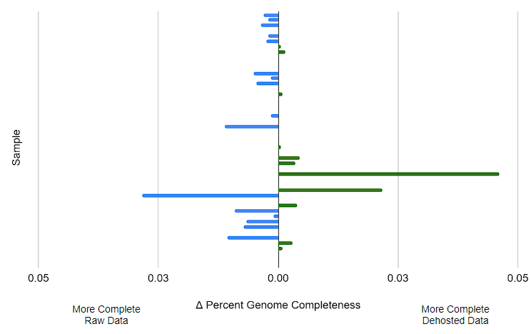
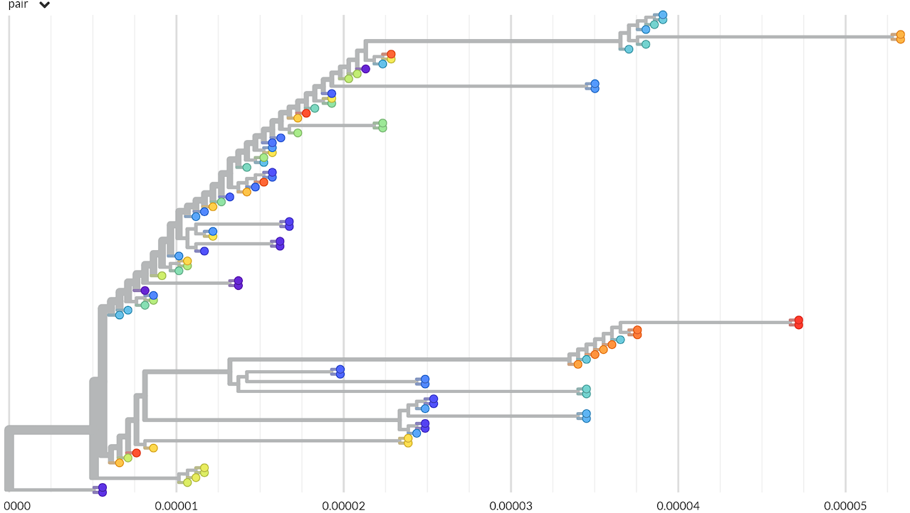
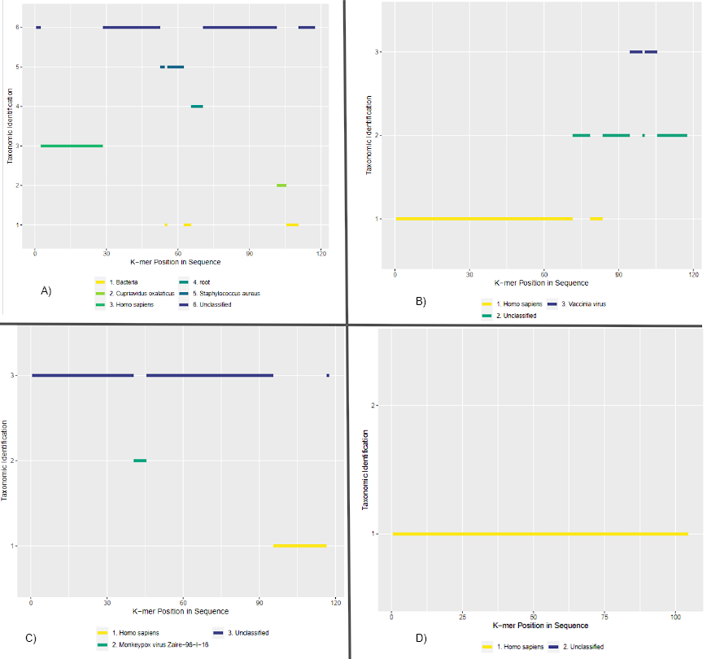

# Monkeypox Host Removal Analysis Report 

| **SOP Code:** | N/A |
|---|---|
| **Title of Method:** | Monkeypox Viruse Metagenomic Illumina Shotgun Host Removal |
| **Scope of Method:** | To describe and validate the analytical pipeline for the host removal (dehosting) of human data from metagenomic Illumina shotgun monkeypox virus positive specimens. Dehosting is required to protect patient privacy while retaining MPXV-mapping reads to preserve the accuracy and specificity of MPXV consensus sequences. |

**Part 1: Test Description**
<table>
  <tr>
  <td>
    <b>Diagnostic Application:&emsp;</b> </td>
    <td>□ Primary Diagnostics	 □ Confirmatory Testing	 ■ Lab Surveillance&emsp;</td>
  </tr>
  <tr>
    <td colspan="2">
      &emsp;□ 1. Association of Official Analytical Chemists (AOAC)<br>
      &emsp;□ 2. Clinical and Laboratory Standards Institute (CLSI)<br>
      &emsp;□ 3. Protocol from a peer-reviewed published method<br>
      &emsp;□ 4. Commercial assay for diagnostic purposes<br>
      &emsp;□ 5. Commercial assay for research purposes<br>
      &emsp;□ 6. Modified/adapted protocol from a published method<br>
      &emsp;□ 7. Modified/adapted commercial assay for diagnostic purposes<br>
      &emsp;□ 8. Modified/adapted commercial assay for research purposes<br>
      &emsp;■ 9. In-house developed<br>
      &emsp;□ 10. Other:  <br>
    </td>
  </tr>
  <tr>
    <td colspan="2">
      <b>Software-specific Test Description:</b><br>
      &emsp;1. Tool/data/database development – development of a new process into a standardized pipeline<br>
    </td>
  </tr>
  <tr>
    <td>
      <b>Type of Study Performed:</b>
    </td>
    <td>
      &emsp;Verification<br>
      &emsp;<b>Validation</b>
    </td>
  </tr>
</table>

-----

## 1. Summary
We have developed a host removal process (dehosting), designed for shotgun Illumina monkeypox virus (MPXV) libraries, that removes human genomic reads while retaining MPXV-mapping reads to preserve the accuracy and specificity of MPXV consensus sequences. 49 shotgun Illumina datasets from MPXV-positive samples that generated high-quality consensus genomes (greater than 90% genome completeness) were chosen for inclusion in this validation test. The goal was for each sample to include no blast-identified human reads while ensuring consensus sequence reproducibility between original (raw) and dehosted datasets. Consistency between genomes was defined as less than 0.1% change in genome completeness and less than 2 mutation differences between the raw and dehosted samples. Per sample, the average kraken2-identified human read percentage in the dehosted dataset was found to be 0.028% ± 0.014% with the largest sample human read percentage at 0.061% (24/39140 reads). The Blastn results of these kraken2-identified human reads lead to NONE of them being classified as human any longer. Thus, the output number of blast-identified human reads met our threshold of 0 overall demonstrating that the dehosting process successfully removes human data at the level required for our submission standards. The dehosting approach retained 99.97% MPXV molecules. Consensus sequences generated with raw and dehosted data using the draft MPXV pipeline were highly consistent with all 49 datasets being below the 0.1% change in genome completeness needed to be considered reproducible for this validation. The content of each consensus sequence was compared with nextclade which showed that no samples had any single nucleotide polymorphisms (SNP) nor indel differences across the full genome length. 

The tested dehosting protocol effectively removed host genomic material without adversely impacting the MPXV analysis. This protocol is fit for use in its current version. 

## 2. Purpose
Validate that the draft host removal process designed for shotgun Illumina MPXV sample datasets keeps no blast-identified human reads per sample (<0.01% kraken2-identified reads per sample as Kraken2 is quicker to estimate counts) and that the subsequently generated dehosted fastq files are able to reproduce comparable MPXV sample consensus sequences which are within ± 0.1% genome completeness (197 basecalled positions) of the raw data and less than 2 SNP differences.

## 3. Dataset
The validation dataset contained 49 MPXV positive samples generated using Illumina Nextera XT libraries for shotgun sequencing on either a NextSeq platform or a MiSeq instrument. Datasets were selected based on the previous raw data analysis generating consensus sequences with greater than 90% genome completeness. The initial paired fastq datasets contained 1.64 billion total reads with 1.59 billion human and 13.8 million MPXV identified reads in total. 

## 4. Procedure

1. Identification of raw fastq read counts for human and MPXV using [Kraken2](https://github.com/DerrickWood/kraken2) k-mer database
    
    The raw paired fastq sequence files were run on Kraken2 using a confidence score of 0.1 and the May 17, 2021 general k-mer database to identify the number of reads associated with either human or MPXV k-mers. The final results were parsed out from the kraken report files.

2. Generation of raw data consensus sequences and dehosted fastq files using the [monkeypox nextflow pipeline](https://github.com/phac-nml/monkeypox-nf)

    Raw fastq sequence files were run through the MPXV pipeline to generate consensus sequences, sample quality metrics, and dehosted fastq files. The pipeline utilized a composite mapping approach mapping reads with BWA-MEM to a composite reference containing the human Hg38 and the nextclade MPXV (MT903344.1) reference genomes (We now use the NCBI RefSeq 'NC_063383.1' MPXV reference in the pipeline). Following read mapping, the composite bam file is then filtered using `samtools view` with the MPXV header ('MT903344.1/MPXV-UK_P2/UK/2018') to select reads mapping to just the MPXV reference genome at a minimum mapping quality of 0.

    Read mapping commands, bam sorting and indexing:  
    
    ```
    bwa mem -t 32 -T 30 $composite_ref $read1 $read2  
    samtools sort --threads 10 -o ${sample}.composite.mapped.sorted.bam  
    samtools index ${sample}.composite.mapped.sorted.bam
    ```

    The filtered bam file is subsequently used to create dehosted fastq files using `samtools fastq` and to generate the sample consensus sequence using `ivar consensus`. Parameters used included a minimum coverage depth of 10 and a quality score of 20 to be basecalled. Finally, sample quality metrics were measured using `samtools depth` and `seqtk comp` to be combined into a singular output CSV file.

3. Identification of dehosted fastq read counts for human and MPXV using Kraken2 k-mer database

    Dehosted paired fastq files previously generated in step 2 were run with the same Kraken2 arguments and database as step 1 to determine the number of human-identified and MPXV reads in the dehosted fastq files. Again, final results were parsed from the kraken report files.

4. Generation of dehosted consensus sequences using the development monkeypox nextflow pipeline

    The dehosted fastq files were run with same MPXV pipeline using the same parameters to regenerate the sample consensus sequences and quality metrics.

5. Comparison of sample quality metrics for raw and dehosted data

    The pipeline sample quality metrics and Kraken2 report metrics were combined together to create one CSV file for each of the raw and dehosted dataset analyses. These data points were summarized and plotted to assess sample read counts and genome completeness. Other sample metrics such as SNPs and indels were compared by running nextclade (MPXV web-version) on the consensus sequences and analyzing the data with a custom python script.

6. Tree building of output consensus sequences
    
    Both raw and dehosted consensus sequences were aligned using mafft to create a multiple sequence alignment (MSA) which was pruned of poorly aligned regions with Gblocks. From the MSA, a maximum likelihood tree was generated using IQ-Tree with a bootstrap replicate value of 100 (`-b 100`) and a standard model selection followed by tree inference (`-m TEST`). Results were visualized with Auspice and coloured based on the sample name.

7. Dehosted kraken-identified human read analysis

    Dehosted kraken-identified human reads were visualized using the krakenreports tool (https://github.com/TheZetner/krakenreports/) to see how kraken-kmers mapped within the reads. After, all output human-identified reads were run with blastn v2.12.0 on the command line using a snapshot of the NCBI nucleotide database from November 5th, 2020. The top 10 hits for each read (forward and reverse) were tallied based on the subject common name identified to determine what organism the read was from. The blastn command utilized was:

    ```
    blastn -query blast_in.fasta -out results_all.csv -db nt -outfmt '10 qseqid sseqid sacc length pident gapopen gaps evalue bitscore scomnames' -max_target_seqs 10 -num_threads 24
    csvtk freq -f 'scomnames' results_all.csv | csvtk sort -k 2:Nr > result_frequency.csv
    ```

## 5. Results

For the 49 sample dataset, over 1.64 billion raw reads were analyzed with an average of 32.4 million reads per sample (min: 7.54 million, max: 73.5 million). Of these reads, 1.59 billion (96.87% of total) were identified by Kraken2 as human and 13.8 million (0.84% of total) were identified as MPXV (Figure 1). After host removal, the total number of reads was reduced to 16.2 million with 3777 human identified reads remaining equating to 0.023% of the dataset. Per sample, the average human identified read percentage was found to be 0.028% ± 0.014% with the largest per sample percentage at 0.061%. Based on the validation criteria of a dehosted dataset containing less than 0.1% of the total reads identified as human, the host removal process adequately removes human reads in both the overall dataset and on a per sample basis reaching our validation thresholds. MPXV reads make up 85.34% of the dehosted dataset with 99.97% of reads initially identified as MPXV retained in the final dataset (Figure 1). The majority of the remaining reads (~2 million) are classified to the orthopoxvirus taxonomic level by Kraken2.


**Figure 1.** Log10 sum of total dataset read counts before and after dehosting. The total, human identified, and MPXV identified paired reads counts were parsed from the Kraken2 report which was generated using the May 17, 2021 general k-mer database with reads identified at a confidence of 0.1 and then summed together based on the input data type. Blue is raw data read counts, green is dehosted data read counts.

Consensus sequences were generated with both the raw and dehosted fastq files to validate that the sample genome completeness was within the required ± 0.1% threshold set for the validation. The largest change in genome completeness between original and dehosted consensus sequences was 0.046% (91 Ns; Figure 2). For all samples, the average genome completeness difference was 0.0039% ± 0.0083% (7 ± 16 Ns different) with 11 samples being more complete when run using the dehosted fastq data, 16 being more complete using the raw fastq data, and the final 22 being identical using either data source (Figure 2). All sample genome completeness metrics met our validation criteria (< 0.1% difference). 



**Figure 2.** Change in final genome completeness of all samples. The difference was calculated as dehosted data genome completeness % - raw data genome completeness %. Bars on the left demonstrate samples where the raw data generated more complete genomes while bars on the right represent samples where the dehosted data generated more complete genomes.

Next, we evaluated the consensus sequence similarity of raw vs. dehosted datasets. The Nextclade output was used to evaluate sample metrics including SNPs, indels, and the Nextclade QC scores. Results show that all samples had identical SNP and indel profiles when comparing the consensus sequences from raw and dehosted datasets.

To evaluate and visualize genetic divergence, we built a phylogeny to verify that raw and dehosted consensus sequences for each sample clustered together (Figure 3). The phylogeny indicates that there are a few samples that do not cluster exactly with their pair. The tree laddering seen is likely an artefact driven by the small differences in genome completeness as both iqTree and auspice force bifurcations in the tree.



**Figure 3.** Sample maximum likelihood tree generated using IQ-Tree. Samples were first aligned with mafft and then pruned of poorly aligned regions with Gblocks. From there, IQ-Tree was run with a standard model selection followed by tree inference with the output newick tree visualized using Auspice with sample raw and dehosted consensus sequences coloured together.

All 3777 human-identified reads were visualized using the [krakenreports tool](https://github.com/TheZetner/krakenreports/) (Figure 4) to show how Kraken2 interprets which part(s) and how much of the reads contained human data. From this report, 50 sequences were randomly selected for manual review in which the read was run through megablast and blastn to compare to the krakenreport pattern shown. Reads that had more human kmers identified (Figure 4-D) were found to have high genetic similarity to fosmid sequences and are therefore not considered true human reads at risk of containing personally identifiable information. The other randomly selected reads identified as human by Kraken2 either did not have any blast hits or hit to MPXV sequences.



**Figure 4.** Krakenreports visualization of four different k-mer mapping patterns containing human-identified reads using Kraken2. All human reads were run through the krakenreports tool to visualize the output and show the alignment of human kmers to the read. A) Report demonstrating a read with several unclassified and classified kmer hits to many bacterial taxa and human reference within a read. B) Report showing a read with half the sequence identified as human. C) Report demonstrating a mostly unclassified read with a few k-mer hits to human. D) Report with a read classified as almost all human across the sequence.

As manual review could only be done for a small subsection of the reads, the remaining ones were run with command line blastn version 2.12.0+ on a snapshot of the NCBI nucleotide database from November 5th, 2020 to fully confirm that there were no human reads left. The top 10 lowest E-value scores for each read (both forward and reverse) were parsed with no human sequences identified. The top subject found was MPXV (Table 1). 

**Table 1.** Most frequent subject common names identified in Kraken2 human-identified fastq reads.

| Subject Identified Common Name | Blast Counts |
|---|---|
| Monkeypox virus | 60964 |
| Ralstonia solanacearum | 514 |
| Staphylococcus aureus | 306 |
| Vaccinia virus | 204 |
| Cowpox virus | 161 |
| Variola virus | 100 |
| Klebsiella variicola | 24 |
| Orthopoxvirus Abatino | 12 |
| pineapple | 9 |
| Akhmeta virus | 7 |
